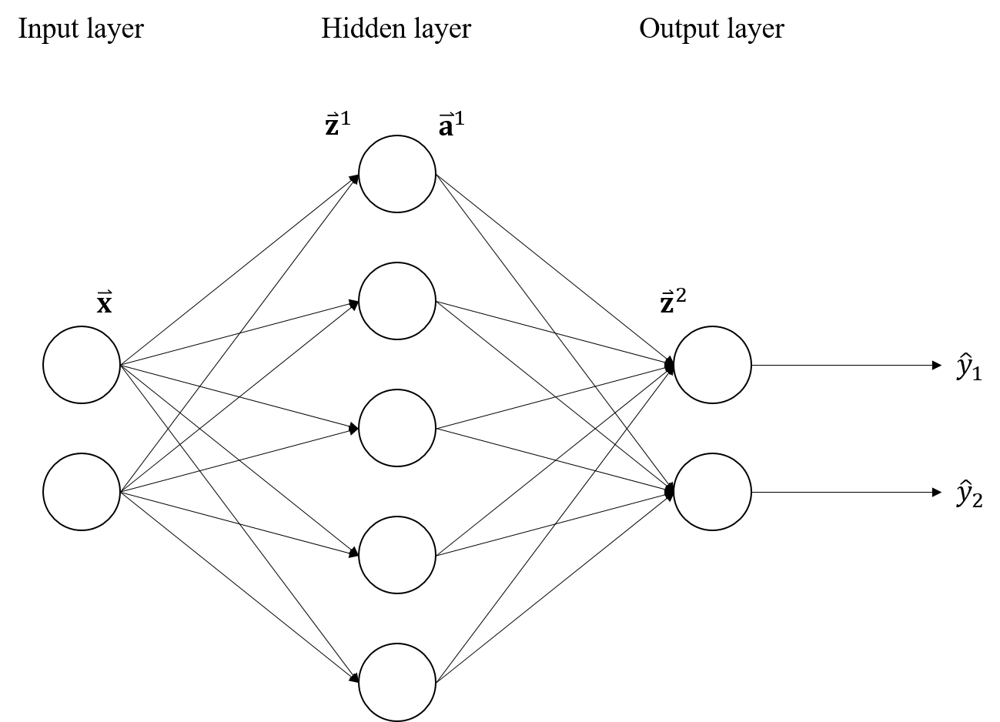

# Simple Neural Network

<!--https://latex.codecogs.com/eqneditor/editor.php-->

- Simple MLP in Python using Numpy.
- Implementation of forward pass and back propagation algorithm.
- Focus on classification problems.

Reference:
- https://github.com/zinsmatt/Neural-Network-Numpy
- https://github.com/nishank974/Neural-Network-numpy

## Model Structure

 

## Forward

 

 

 

<!--

$$\mathrm{W}^1,\mathrm{W}^2: \mathrm{model \,\, weights}$$

$$\vec{\mathrm{z}}^{1} = \mathrm{W}^{1} \vec{\mathrm{x}}$$

$$\vec{\mathrm{a}}^{1} = \mathrm{tanh}(\vec{\mathrm{z}}^{1})$$

$$\vec{\mathrm{z}}^{2} = \mathrm{W}^{2} \vec{\mathrm{a}}^{1}$$

$$\vec{\hat{\mathrm{y}}} = \mathrm{softmax}(\vec{\mathrm{z}}^{2})$$

-->

where

 

<!--
$$\mathrm{tanh}(x)=\frac{\exp(2x)-1}{\exp(2x)+1}$$

$$\hat{y}_k=\frac{\exp(z_k^2)}{\sum_{j}{\exp(z_j^2)}}, \,\, k=1,2$$
-->

In addition

<!--
$$\frac{d\,\mathrm{tanh}(x)}{dx}=1-\mathrm{tanh}^2(x)$$
-->

## Back propagation

Cost function (cross entropy):
$$C(\Theta)=-\sum_{i}{y_i \log(\hat{y}_{i})}$$

$$\Theta:\mathrm{model \,\, parameters}$$

$$C(\Theta)=-\sum_{i}{y_i \log(\frac{\exp(z_i^2)}{\sum_{j}{\exp(z_j^2)}})}$$

### 1
$$\begin{aligned}
\frac{\partial C}{\partial z^2_k} &= -\sum_{i}{y_i \frac{\sum_{j}{\exp(z_j^2)}}{\exp(z_i^2)} ( \frac{\partial}{\partial z^2_k} \frac{\exp(z_i^2)}{\sum_{j}{\exp(z_j^2)}} ) } \\
&= -\sum_{i}{y_i(I_{\{i=k\}}(i,k)-\frac{\exp(z_k^2)}{\sum_{j}{\exp(z_j^2)}})} \\
&= -\sum_{i}{y_i(I_{\{i=k\}}(i,k)-\hat{y}_k)} \\
&= \hat{y}_k - y_k \\
\end{aligned}
$$

$$\frac{\partial C}{\partial \vec{\mathrm{z}}^2}=\vec{\hat{\mathrm{y}}}-\vec{\mathrm{y}}$$

### 2
$$\begin{aligned}
\frac{\partial C}{\partial w_{ij}^2} &= \frac{\partial z_i^2}{\partial w_{ij}^2} \frac{\partial C}{\partial z_i^2} \\
&= a_j^1 (\hat{y}_i-y_i)
\end{aligned}
$$

$$\begin{aligned}
\frac{\partial C}{\partial \mathrm{W}^2} 
&= \begin{bmatrix}
\frac{\partial C}{\partial w_{11}^2} & \frac{\partial C}{\partial w_{12}^2} & \frac{\partial C}{\partial w_{13}^2} \\
\frac{\partial C}{\partial w_{21}^2} & \frac{\partial C}{\partial w_{22}^2} & \frac{\partial C}{\partial w_{23}^2}
\end{bmatrix} \\
&= \begin{bmatrix}
a_1^1(\hat{y}_1 - y_1) & a_2^1(\hat{y}_1 - y_1) & a_3^1(\hat{y}_1 - y_1) \\
a_1^1(\hat{y}_2 - y_2) & a_2^1(\hat{y}_2 - y_2) & a_3^1(\hat{y}_2 - y_2)
\end{bmatrix} \\
&= \begin{bmatrix}
\hat{y}_1 - y_1 \\
\hat{y}_2 - y_2
\end{bmatrix}
\begin{bmatrix}
a_1^1 & a_2^1 & a_3^1
\end{bmatrix} \\
&= \frac{\partial C}{\partial \vec{\mathrm{z}}^2} \vec{\mathrm{a}^1}^{\top}
\end{aligned}
$$

### 3

$$\begin{aligned}
\frac{\partial a^1_k}{\partial z^1_k} &= \frac{\partial \, \mathrm{tanh}(z^1_k)}{\partial z^1_k} \\
&= 1 - \mathrm{tanh}^2(z^1_k)
\end{aligned}
$$

$$\begin{aligned}
\frac{\partial C}{\partial z^1_k} &= \frac{\partial a^1_k}{\partial z^1_k} \frac{\partial C}{\partial a^1_k} \\
&= \frac{\partial a^1_k}{\partial z^1_k} \left[\sum_{j}{\frac{\partial z^2_j}{\partial a^1_k} \frac{\partial C}{\partial z^2_j}} \right] \\
&= \left( 1 - \mathrm{tanh}^2(z^1_k) \right) \left[\sum_{j}{w_{jk}^2 \frac{\partial C}{\partial z^2_j}} \right] \\
&= \left( 1 - \mathrm{tanh}^2(z^1_k) \right) \left( \begin{bmatrix}
w_{1k}^2 & w_{2k}^2
\end{bmatrix} \begin{bmatrix}
\frac{\partial C}{\partial z^2_1} \\ \frac{\partial C}{\partial z^2_2}
\end{bmatrix} \right)
\end{aligned}
$$

$$\begin{aligned}
\frac{\partial C}{\partial \vec{\mathrm{z}}^1} &= \left( 1 - \mathrm{tanh}^2(\vec{\mathrm{z}}^1) \right) \left( \mathrm{W^{2}}^{\top} \frac{\partial C}{\partial \vec{\mathrm{z}}^2}\right)
\end{aligned}
$$

### 4

$$\begin{aligned}
\frac{\partial C}{\partial w_{ij}^1} &= \frac{\partial z_i^1}{\partial w_{ij}^1} \frac{\partial C}{\partial z_i^1} \\
&= x_j \frac{\partial C}{\partial z_i^1}
\end{aligned}
$$

$$\begin{aligned}
\frac{\partial C}{\partial \mathrm{W}^1}
&= \begin{bmatrix}
\frac{\partial C}{\partial w_{11}^1} & \frac{\partial C}{\partial w_{12}^1} \\
\frac{\partial C}{\partial w_{21}^1} & \frac{\partial C}{\partial w_{22}^1} \\
\frac{\partial C}{\partial w_{32}^1} & \frac{\partial C}{\partial w_{32}^1} \\
\frac{\partial C}{\partial w_{41}^1} & \frac{\partial C}{\partial w_{42}^1} \\
\frac{\partial C}{\partial w_{51}^1} & \frac{\partial C}{\partial w_{52}^1}
\end{bmatrix} \\
&= \begin{bmatrix}
x_1\frac{\partial C}{\partial z_{1}^1} & x_2\frac{\partial C}{\partial z_{1}^1} \\
x_1\frac{\partial C}{\partial z_{2}^1} & x_2\frac{\partial C}{\partial z_{2}^1} \\
x_1\frac{\partial C}{\partial z_{3}^1} & x_2\frac{\partial C}{\partial z_{3}^1} \\
x_1\frac{\partial C}{\partial z_{4}^1} & x_2\frac{\partial C}{\partial z_{4}^1} \\
x_1\frac{\partial C}{\partial z_{5}^1} & x_2\frac{\partial C}{\partial z_{5}^1}
\end{bmatrix} \\
&= \begin{bmatrix}
\frac{\partial C}{\partial z_{1}^1} \\
\frac{\partial C}{\partial z_{2}^1} \\
\frac{\partial C}{\partial z_{3}^1} \\
\frac{\partial C}{\partial z_{4}^1} \\
\frac{\partial C}{\partial z_{5}^1}
\end{bmatrix} \begin{bmatrix} x_1 & x_2 \end{bmatrix} \\
&= \frac{\partial C}{\partial \vec{\mathrm{z}}^1} \vec{\mathrm{x}}^{\top}
\end{aligned}
$$